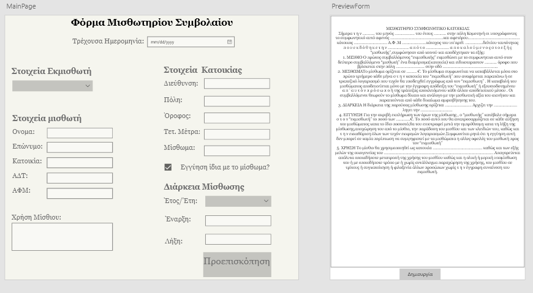

# MisthwthrioAPP

> Μια πρώτη εικόνα από την αρχική σελίδα του προγράμματος στο AdobeXD

---

###  Πίνακας Περιεχομένων

- [Περιγραφή](#περιγραφή)
- [Xαρακτηριστικά](#χαρακτηριστικά)
- [Τεχνολογίες](#τεχνολογίες)
- [Highlights](#Highlights)
---

## Περιγραφή
Το παρόν πρόγραμμα είναι μια φόρμα όπου ο χρήστης συμπληρώνει τα στοιχεία που χρειάζονται για την δημιουργία μισθωτήριου 
συμβολαίου.Στη συνέχεια μπορεί να δει στην προεπισκόπηση πως είναι η πρώτη σελίδα του συμβολαίου με τα στοιχεία και πατώντας την δημιουργία θα δημιουργηθούν δύο αρχεία ένα τύπου PDF και ένα RTF που περιέχουν το ολοκληρωμένο συμβόλαιο.

   
[Back To The Top](#misthwthrioapp)

---

## Xαρακτηριστικά
- Φόρμα για την συμπλήρωση των απαραίτητων στοιχείων
- Υπολογισμός λήξης συμβολαίου βάση της ημερομηνίας έναρξης και τα έτη ισχύος συμβολαίου
- Προεπισκόπηση αποτελέσματος
- Μετατροπή από RTF->PDF αρχείο
- Συγχώνευση RTF Και PDF αρχείων

[Back To The Top](#misthwthrioapp)

---

## Τεχνολογίες

- C#
- PdfSharp
- Syncfusion
- Visual Studio 2019

[Back To The Top](#misthwthrioapp)

---

## Highlights

> Γρήγορη ματιά στην εφαρμογή
 

 

[Back To The Top](#misthwthrioapp)